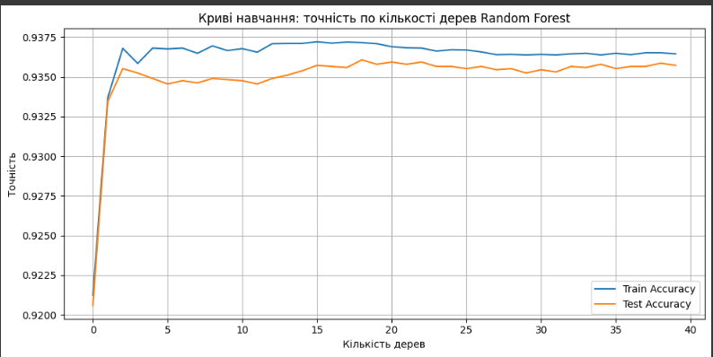

# 📈 Churn Prediction App

Інтерактивний застосунок для прогнозування відтоку клієнтів телекомунікаційної компанії на базі моделей машинного навчання.  
Реалізовано інтерфейс для одиночного та масового прогнозу (через CSV), запуск через Docker Compose.

## 🚀 Швидкий старт

1. Клонування репозиторію
   
   `git clone https://github.com/TupotaArtem/goit-project-group6`  
   `cd goit-project-group6`

3. Запуск у Docker
   
   `docker-compose up --build`

4. Відкрити у браузері
   
   `http://localhost:8501`

### 🛠️ Структура репозиторію

    ├── app.py
    ├── docker-compose.yml
    ├── Dockerfile
    ├── models
    │   └── best_model_xgboost.pkl
    ├── requirements.txt
    └── README.md
    
### 💻 Особливості роботи з інтерфейсом

•	Індивідуальний прогноз: введіть дані клієнта, натисніть “Прогнозувати” — отримайте ймовірність відтоку та візуалізацію.  

•	Масова обробка (CSV): завантажте CSV-файл, отримаєте ймовірності для всіх клієнтів, графіки, кнопку для збереження результатів.

### 📄 Формат CSV для масового прогнозу

    is_tv_subscriber,is_movie_package_subscriber,subscription_age,bill_avg,reamining_contract,service_failure_count,download_avg,upload_avg,download_over_limit,contract_unknown
    1,0,12,25.5,8,0,50.0,10.0,1.5,0
    0,1,6,15.0,3,1,20.0,5.0,0.0,1
    ...

•	Важливо: усі назви стовпців та порядок — як у прикладі!

### ⚙️ Налаштування (опціонально)  
    
•	Файл моделі має лежати в `models/`.  

•	Якщо потрібно оновити модель, просто замініть файл і перезапустіть сервіс.

### 🔍 Вибір моделей, метрик та оцінювання
🧠 Розгляд моделей
У проєкті було протестовано кілька популярних моделей класифікації:

Logistic Regression — проста лінійна модель, використана як базовий еталон.

Random Forest — ансамбль дерев, що демонструє високу точність та стійкість до перенавчанню.

XGBoost — потужний бустинг-алгоритм з регуляризацією.

### 🎯 Вибір найкращої моделі
Хоча ми розглядали всі три моделі, найкращі результати на тестових даних показав Random Forest. Саме ця модель продемонструвала баланс між точністю, стабільністю і узагальнювальною здатністю, тому вона обрана для подальшого використання.
Отримані метрики на тесті:
Accuracy: 0.936
Precision: 0.947
Recall: 0.935
F1-score: 0.941

### ⚙️ Налаштування моделей
Для XGBoost застосували регуляризацію (reg_alpha, reg_lambda) та ранню зупинку.

Для Random Forest підібрали параметри (max_depth, min_samples_leaf, min_samples_split), щоб запобігти перенавчанню.

Для Logistic Regression додали L2-регуляризацію через параметр C.

### 📊 Метрики оцінки
Оцінка моделей базувалась на ключових метриках:

Accuracy — загальна точність.

Precision — точність позитивного класу.

Recall — повнота позитивного класу.

F1-score — збалансоване середнє precision і recall.

### 📈 Криві навчання
Для моделі побудовано графік навчання, що ілюструє:

Динаміку точності на тренувальному та тестовому наборі (по епохах або кількості дерев).

Цей графік допомагає оцінити якість навчання, виявити можливе перенавчанню або недонавчання.